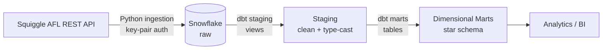

# AFL Analytics Pipeline
 
An end-to-end ELT pipeline that ingests Australian Football League (AFL) data from the public [Squiggle API](https://api.squiggle.com.au/), loads it into Snowflake, and models it into a clean, query-ready dimensional warehouse using dbt.
 
This is a self-directed project built to demonstrate modern data stack skills: Python-based ingestion, secure cloud warehouse loading, layered dbt modelling and star schema.

## Architecture

 
Raw data is ingested with Python and landed in Snowflake. dbt then transforms it through two layers: **staging** models (materialised as views) clean and type-cast the raw source columns, and **marts** models (materialised as tables) build the dimensional star schema for analytics.
 
## Project structure
 
```
afl_project/
├── ingestion/        # Python scripts: pull from Squiggle API, load to Snowflake
├── dbt/              # dbt project: staging + marts models, sources, dbt_project.yml
├── setup/            # Environment / warehouse setup
├── requirements.txt
├── .gitignore        # excludes credentials / keys
└── README.md
```
 
---

## Data model
 
The marts layer is a star schema designed for game- and team-level analysis:
 
| Model | Type | Description |
|---|---|---|
| `dim_teams` | Dimension | One row per team: descriptive team attributes |
| `fct_games` | Fact | One row **per team per game**: unions the home and away perspectives into a single grain, with a derived win/loss column |
| `agg_ladder` | Aggregate | Calculated team ladder positions derived from game results |

## Prerequisites
- **Python 3.13** dbt Core doesn't support 3.14 yet, so use 3.13 for the dbt environment
- A Snowflake account (free trial is fine)
- `pip install -r requirements.txt`

## Getting started
> Note: update the paths/commands below to match your local setup.
 
**1. Configure credentials**
Set up your Snowflake key-pair authentication and dbt `profiles.yml`. Set up dev and prod environment in profiles
 
**2. Run ingestion**
 
```bash
python ingestion/<your_ingestion_script>.py
```

Pull the source datasets from the Squiggle API and loads them into the raw schema in Snowflake.
 
**3. Build the dbt models**
 
```bash
cd dbt
dbt deps        # install any dbt packages
dbt run                 # runs against your default target (dev)
dbt run --target prod   # runs the same models against the prod target
```
 
To target Postgres instead of Snowflake, select the relevant profile/target when running dbt.
 
---
